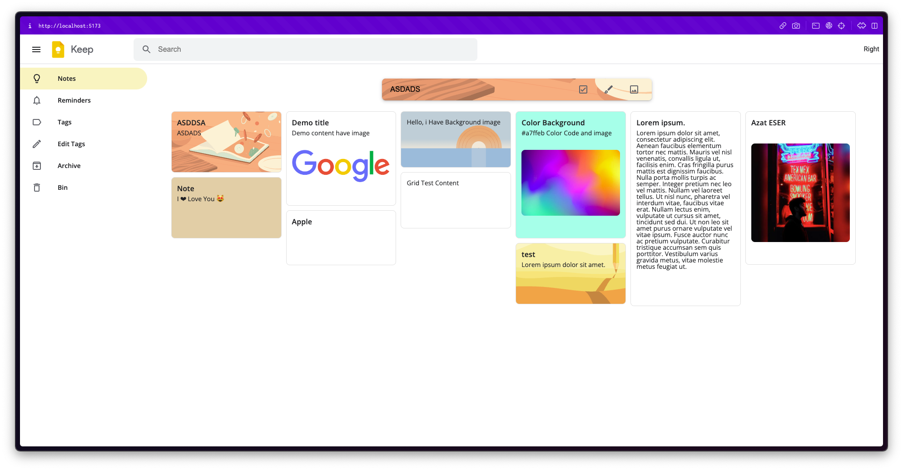

# Google KeepNote Clone

This is a clone of Google KeepNote App. This is a simple note taking app. This app is built using React. This app is built for learning purpose.

## Table of Contents

- [Demo](#demo)
- [Features](#features)
- [Screenshots](#screenshots)
- [Installation](#installation)
- [Road Map](#road-map)

## Demo (Live Preview)

[Live Demo](#)

## Features

- Add Note
- Note Color
- Note Image
- Note Todo Feature
- Delete Note Add Bin
- UnBin Note
- Edit Note
- Search Note
- Pin Note
- Unpin Note
- Archive Note
- Unarchive Note
- Add Tag

## Screenshots



## Installation

```bash
git clone 
cd keepnote
npm install
npm start
```


## Road Map

[✅] UI Design <br />
[✅] Learn Redux & Implement <br />
[✅] Get Notes <br />
[✅] Add Note <br />
[✅] Note Color <br />
[⌛] Note Image <br />
[⌛] Note Todo Feature <br />
[⌛] Delete Note Add Bin <br />
[⌛] UnBin Note <br />
[⌛] Edit Note <br />
[⌛] Search Note <br />
[⌛] Pin Note <br />
[⌛] Unpin Note <br />
[⌛] Archive Note <br />
[⌛] Unarchive Note <br />
[⌛] Add Tag <br />


[⬆ Back to top](#table-of-contents)

